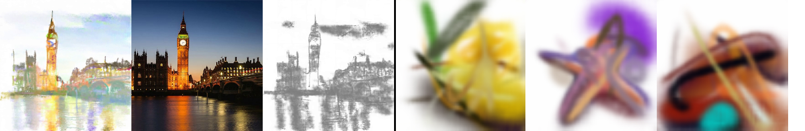
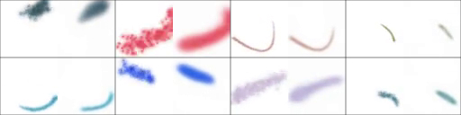
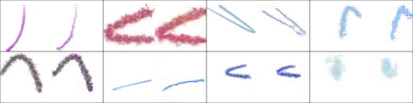
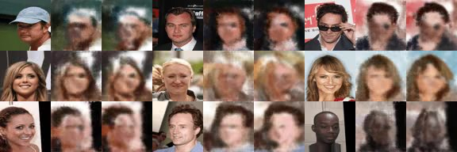
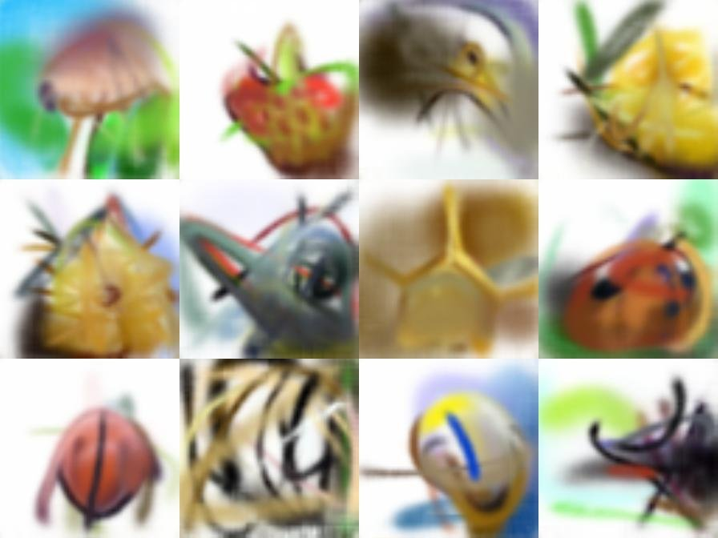
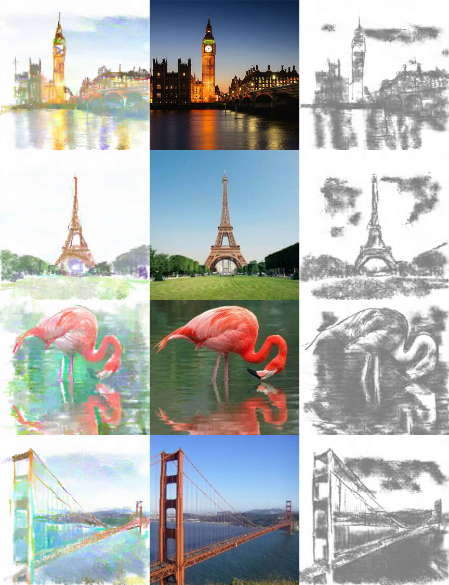

# Neural Painters: A learned differentiable constraint for generating brushstroke paintings

https://arxiv.org/abs/1904.08410

## Abstract

We explore neural painters, a generative model for brushstrokes learned from a real non-differentiable and non-deterministic painting program. We show that when training an agent to "paint" images using brushstrokes, using a differentiable neural painter leads to much faster convergence. We propose a method for encouraging this agent to follow human-like strokes when reconstructing digits. We also explore the use of a neural painter as a differentiable image parameterization. By directly optimizing brushstrokes to activate neurons in a pre-trained convolutional network, we can directly visualize ImageNet categories and generate "ideal" paintings of each class. Finally, we present a new concept called *intrinsic style transfer*. By minimizing only the content loss from neural style transfer, we allow the artistic medium, in this case, brushstrokes, to naturally dictate the resulting style.

## Notebooks

There are runnable notebooks for the paper in the [`notebooks/`](https://github.com/reiinakano/neural-painters/tree/master/notebooks) folder.

To completely reproduce the paper from scratch, there is technically a logical order in which to run these notebooks. 

However, since most people will probably only be interested in certain parts of the paper, we have designed them so you will be able to run each part as standalone notebooks. For example, we have provided pre-trained neural painters so you can run the style transfer notebook without having to train your own neural painter.

**Note on code quality** - I will be the first to tell you that the code quality of these notebooks is not production-level. If you have any questions or trouble understanding the code, please feel free to open an issue and ask.

# Notebook descriptions

* [`generate_stroke_examples.ipynb`](https://colab.research.google.com/github/reiinakano/neural-painters/blob/master/notebooks/generate_stroke_examples.ipynb) - This notebook contains code to generate pre-calculated mappings from action space to brushstroke image. If you don't want to run this, you can always just use the ones we uploaded to [Kaggle](https://www.kaggle.com/reiinakano/mypaint_brushstrokes).

* [`train_vae_painter.ipynb`](https://colab.research.google.com/github/reiinakano/neural-painters/blob/master/notebooks/train_vae_painter.ipynb) and [`train_gan_painter.ipynb`](https://colab.research.google.com/github/reiinakano/neural-painters/blob/master/notebooks/train_gan_painter.ipynb) - These notebooks contain code to train VAE and GAN neural painters, respectively. Requires the output from `generate_stroke_examples.ipynb`.

* [`recreating_spiral.ipynb`](https://colab.research.google.com/github/reiinakano/neural-painters/blob/master/notebooks/recreating_spiral.ipynb) - Contains code for the "Recreating SPIRAL Results" section in the paper. Requires a neural painter. We provide pre-trained neural painters if you don't want to train your own.

* [`learning_human_strokes.ipynb`](https://colab.research.google.com/github/reiinakano/neural-painters/blob/master/notebooks/learning_human_strokes.ipynb) - Contains code for the "Towards Learning Human Strokes" section of the paper. Requires a neural painter. We provide pre-trained neural painters if you don't want to train your own.

* [`visualizing_imagenet_classes.ipynb`](https://colab.research.google.com/github/reiinakano/neural-painters/blob/master/notebooks/visualizing_imagenet_classes.ipynb) - Contains code for the "Visualizing ImageNet Classes" subsection of the paper. Requires a neural painter. We provide pre-trained neural painters if you don't want to train your own.

* [`intrinsic_style_transfer.ipynb`](https://colab.research.google.com/github/reiinakano/neural-painters/blob/master/notebooks/intrinsic_style_transfer.ipynb) - Contains code for the "Intrinsic Style Transfer" subsection of the paper. Requires a neural painter. We provide pre-trained neural painters if you don't want to train your own.

